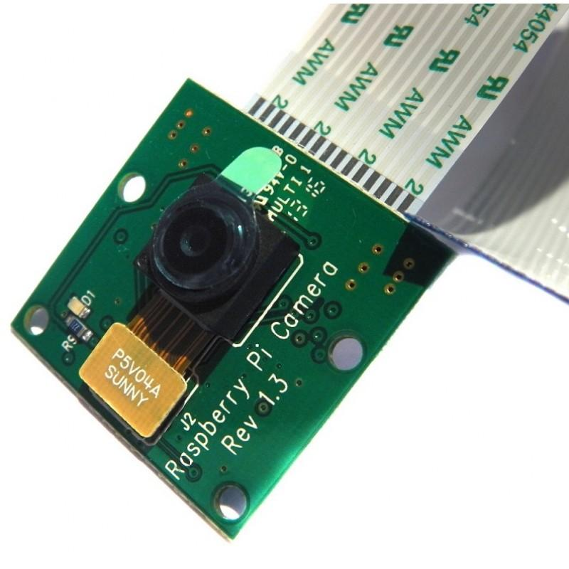
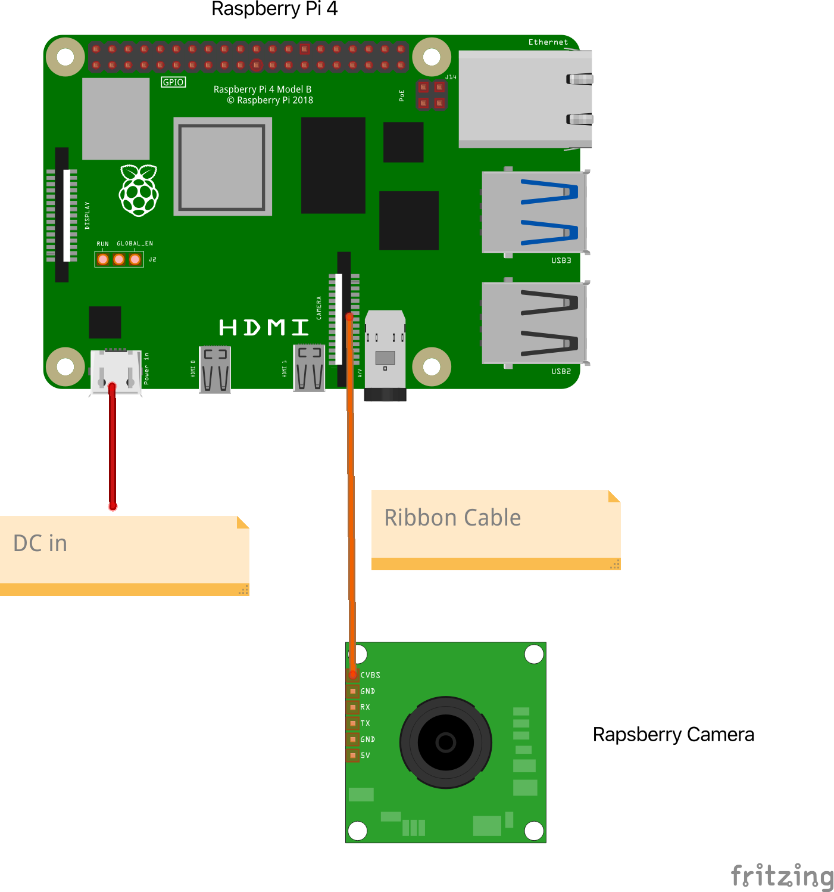

# Raspberry Setup[WIP]

## Raspberry Camera v1.3

### Specs
- Still resolution: 5 Megapixels
- Video modes: 1080p30, 720p60 
- Linux integration: V4L2 driver available
- C programming API: OpenMAX IL and others available
- Sensor: OmniVision OV5647
- Sensor resolution: 2592 × 1944 pixels
- Sensor image area: 3.76 × 2.74 mm
- Pixel size: 1.4 µm × 1.4 µm
- Optical size: 1/4"
- Full-frame SLR lens equivalent: 35 mm
- S/N ratio: 36 dB
- Dynamic range: 67 dB @ 8x gain
- Sensitivity: 680 mV/lux-sec
- Dark current: 16 mV/sec @ 60 C
- Well capacity: 4.3 Ke-
- Fixed focus: 1 m to infinity
- Focal length: 3.60 mm +/- 0.01
- Horizontal field of view: 53.50 +/- 0.13 degrees
- Vertical field of view: 41.41 +/- 0.11 degrees
- Focal ratio (F-Stop): 2.9

## Circuit

